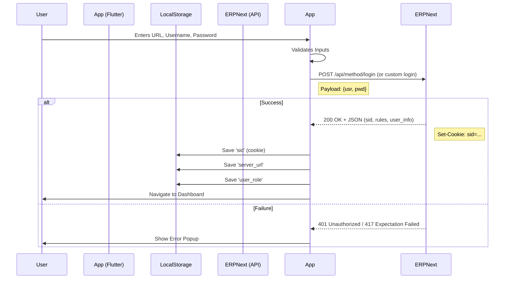

# Auth & Session Flow Diagram (Textual)

## 1. Login Process

## 2. Session Management
- **Token**: ERPNext uses `sid` (Session ID) in cookies.
- **Persistence**: `cookie_jar` manages cookies. `PersistCookieJar` saves them to device storage.
- **Expiry Checking**:
  - Global Dio Interceptor checks for `401` or `403` responses.
  - If `401` detected -> Clear LocalStorage & Redirect to Login.

## 3. Auto-Login
- On App Start -> Check if `sid` cookie exists in `PersistCookieJar`.
- If yes -> Attempt simple API call (e.g. `get_logged_in_user`).
- If success -> Go to Dashboard.
- If failure (401) -> Go to Login.
